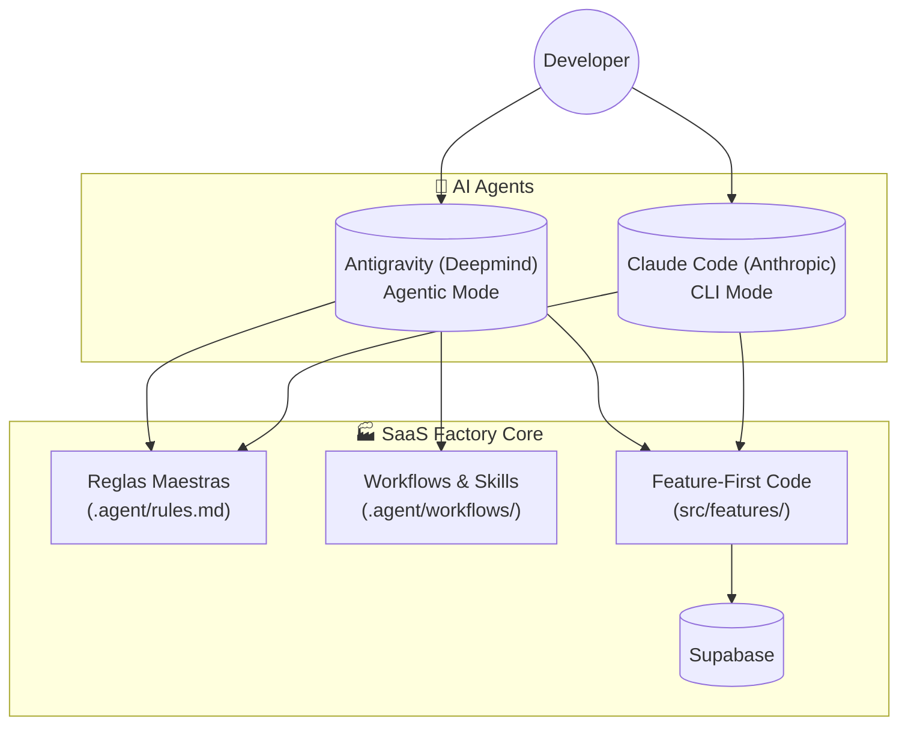

# 🚀 __APP_NAME__ - SaaS Factory V3 — Antigravity Edition

**AI-Agnostic Intelligence** | Setup de Next.js 16 + Supabase + Multi-Agent Control.

Esta es una edición evolucionada de la SaaS Factory, optimizada para ser **100% agnóstica al modelo**. Ha sido blindada para operar con la misma precisión tanto en **Antigravity (Google Deepmind)** como en **Claude Code (Anthropic)**.

## 🎯 El Golden Path (Un Solo Stack)

No damos opciones técnicas. Ejecutamos el stack perfeccionado para que la IA sea 100% productiva desde el minuto uno:

| Capa | Tecnología | Por Qué |
|------|------------|---------|
| **Framework** | Next.js 16 (App Router) | Full-stack nativo, Turbopack es 70x más rápido. |
| **Database** | Supabase (PostgreSQL) | Auth + RLS + Storage sin configuraciones pesadas. |
| **Estilos** | Tailwind CSS 3.4 | Utility-first, evita el context switching. |
| **IA Control** | **Antigravity** / Claude | Multi-agente ready, arquitectura Feature-First. |
| **QA Gate** | ESLint + Typecheck | Blindaje de código antes de cada commit. |

## 🚀 ¿Qué es esto?

Este es el estándar para aplicaciones modernas diseñadas para ser construidas por humanos en colaboración con agentes:

- ✅ **LLM-Agnostic Native**: Estructura blindada para Antigravity, Claude Code y GPT-4.
- ✅ **Setup Next.js 16**: Configuración optimizada para el nuevo motor de compilación.
- ✅ **Arquitectura Feature-First**: Colocalización total (componentes, hooks, tipos) en un solo lugar.
- ✅ **CLI Scaffolder Global**: Crea nuevos proyectos en segundos con `create-saas-factory`.

## 📦 AI Setup

```yaml
Primary Brain: Antigravity (Google)
Secondary Brain: Claude Code (Anthropic)
Universal Support: Cualquier modelo con acceso a tools/MCPs
Architecture: Feature-First + PRP System
```

## 🏗️ Arquitectura Feature-First

```
src/
├── app/                      # Next.js App Router
│   ├── (auth)/              # Rutas auth (grupo)
│   ├── (main)/              # Rutas principales
│   ├── layout.tsx
│   └── page.tsx
│
├── features/                 # 🎯 Organizadas por funcionalidad
│   ├── auth/
│   │   ├── components/      # LoginForm, SignupForm
│   │   ├── hooks/           # useAuth, useSession
│   │   ├── services/        # authService.ts
│   │   ├── types/           # User, Session
│   │   └── store/           # authStore.ts
│   │
│   ├── dashboard/
│   │   ├── components/
│   │   ├── hooks/
│   │   ├── services/
│   │   └── types/
│   │
│   └── [tu-feature]/
│
└── shared/                   # Código reutilizable
    ├── components/          # Button, Card, Input
    ├── hooks/               # useDebounce, useLocalStorage
    ├── stores/              # appStore.ts
    ├── types/               # api.ts, domain.ts
    ├── utils/               # helpers
    ├── lib/                 # supabase.ts, axios.ts
    └── constants/
```

> **¿Por qué Feature-First?** Cada feature tiene TODO lo necesario en un solo lugar. Perfecto para que la IA entienda contexto completo sin navegar múltiples carpetas.

## 🚀 Quick Start

### 1. Instalar Dependencias

```bash
npm install
# o
pnpm install
```

### 2. Configurar Variables de Entorno

```bash
# Crear .env.local
cp .env.example .env.local

# Editar con tus credenciales de Supabase
NEXT_PUBLIC_SUPABASE_URL=tu_supabase_url
NEXT_PUBLIC_SUPABASE_ANON_KEY=tu_anon_key
```

### 3. Configurar MCPs (Opcional)

Edita `.mcp.json` con tu project ref de Supabase:

```json
{
  "mcpServers": {
    "supabase": {
      "args": ["--project-ref=TU_PROJECT_REF"],
      "env": {
        "SUPABASE_ACCESS_TOKEN": "TU_TOKEN"
      }
    }
  }
}
```

### 4. Iniciar Desarrollo

```bash
npm run dev
# Auto-detecta puerto disponible (3000-3006)
```

## 🛠️ Comandos Disponibles

### Development
```bash
npm run dev          # Servidor desarrollo (auto-port 3000-3006)
npm run build        # Build para producción
npm run start        # Servidor producción
```

### Quality Assurance
```bash
npm run test         # Tests con Jest
npm run test:watch   # Tests en modo watch
npm run lint         # ESLint
npm run lint:fix     # Fix automático
npm run typecheck    # TypeScript check
```

### Skills Management
```bash
# Crear nuevo skill
python .claude/skills/skill-creator/scripts/init_skill.py my-skill

# Validar skill
python .claude/skills/skill-creator/scripts/quick_validate.py ./my-skill

# Empaquetar skill
python .claude/skills/skill-creator/scripts/package_skill.py ./my-skill
```

## 🧠 The Dual Brain Architecture ("El Cerebro Dual")

Esta fábrica está diseñada con una arquitectura de **gobernanza híbrida**. No te obligamos a elegir; te damos lo mejor de ambos mundos operando sobre el mismo código base.



### 🌌 Antigravity (Google Deepmind)
**Enfoque**: Gestión de proyectos de largo recorrido, arquitectura y ejecución de planes complejos. Se activa automáticamente en entornos compatibles con Gemini.

| Capa | Recurso | Descripción |
|------|---------|-------------|
| **OS** | `GEMINI.md` | Tu identidad y memoria a largo plazo. |
| **Workflows** | `.agent/workflows/` | Procesos estandarizados que puedes invocar. |
| **Skills** | `.agent/skills/` | Herramientas Python/Node avanzadas. |
| **Agentic** | **Auto-Tasking** | Crea `task.md` y `artifacts` para seguimiento. |

#### ⚡ Workflows Disponibles
Simplemente pide: *"Ejecuta el workflow de..."*

- **`qa`**: Corre el ciclo completo de calidad (Typecheck + Lint + Build).
- **`new-app`**: Inicia el proceso de creación de una nueva aplicación hija.
- **`landing`**: Genera una landing page optimizada basada en tus specs.
- **`eject-sf`**: Prepara el proyecto para entrega final eliminando herramientas de fábrica.

### 🤖 Claude Code (Anthropic)
**Enfoque**: Iteraciones rápidas en terminal, refactoring y consultas directas.

| Comando | Acción |
|---------|--------|
| `/explorador` | Mapa mental de la arquitectura actual. |
| `/generar-prp` | Crea especificaciones de nuevas features. |
| `/ejecutar-prp` | Implementa código basado en una spec aprobada. |
| `/qa` | Ejecuta el script de calidad localmente. |

- 🧠 **Next.js DevTools** - Conectado a `/_next/mcp` para debug en tiempo real
- 👁️ **Playwright** - Validación visual y testing automatizado
- 🗄️ **Supabase** - Integración directa con DB y auth

## 🎨 Bucle Agéntico con Playwright

Este setup incluye integración con Playwright MCP para desarrollo visual:

```
1. Implementar componente
2. Capturar screenshot automático
3. Comparar vs requirements
4. Iterar hasta pixel-perfect
```

Lee `.claude/prompts/bucle-agentico.md` para más detalles.

## 📝 Crear tu Primera Feature

### Opción 1: Manual
```bash
mkdir -p src/features/mi-feature/{components,hooks,services,types,store}
```

### Opción 2: Con Agentes (Antigravity o Claude)

Pide al agente que genere un **PRP (Product Requirements Proposal)**. Al usar el sistema PRP, el agente:
1. Analizará tus requisitos.
2. Generará la estructura completa en `src/features/`.
3. Creará componentes, hooks y tests base automáticamente.

**Prompt Ejemplo:**
*"Genera un PRP para una feature de 'Gestión de Inventario' que permita añadir y listar productos."*

## 🔒 Supabase Setup

### 1. Crear Proyecto en Supabase

```bash
# Visita: https://supabase.com/dashboard
# Crea nuevo proyecto
# Copia URL y Anon Key
```

### 2. Configurar Cliente

El cliente ya está configurado en `src/shared/lib/supabase.ts`:

```typescript
import { createClient } from '@supabase/supabase-js'

export const supabase = createClient(
  process.env.NEXT_PUBLIC_SUPABASE_URL!,
  process.env.NEXT_PUBLIC_SUPABASE_ANON_KEY!
)
```

### 3. Crear Migraciones

```bash
# Guardar migraciones en supabase/migrations/
# Ejemplo: supabase/migrations/001_create_users.sql
```

## 🧪 Testing Strategy

### Unit Tests

```typescript
// src/features/auth/hooks/useAuth.test.ts
import { renderHook } from '@testing-library/react'
import { useAuth } from './useAuth'

test('should authenticate user', async () => {
  const { result } = renderHook(() => useAuth())
  await result.current.login('test@example.com', 'password')
  expect(result.current.user).toBeDefined()
})
```

### Run Tests

```bash
npm run test                    # Run all tests
npm run test:watch              # Watch mode
npm run test:coverage           # Coverage report
```

## 🎯 Best Practices

### Component Structure

```typescript
// ✅ GOOD: Clear props, typed, documented
interface ButtonProps {
  children: React.ReactNode
  variant?: 'primary' | 'secondary'
  onClick: () => void
}

export function Button({ children, variant = 'primary', onClick }: ButtonProps) {
  return (
    <button
      onClick={onClick}
      className={`btn btn-${variant}`}
    >
      {children}
    </button>
  )
}
```

### Feature Organization

```typescript
// ✅ GOOD: Todo relacionado en un lugar
src/features/auth/
├── components/     # UI específicos de auth
├── hooks/          # Lógica de auth
├── services/       # API calls
├── types/          # Types de auth
└── store/          # Estado de auth
```

## 🚨 Troubleshooting

### Puerto Ocupado (EADDRINUSE)

```bash
# El auto-port detection debería resolver esto
# Si persiste:
lsof -i :3000
kill -9 <PID>

# O usa el script directamente:
node scripts/dev-server.js
```

### TypeScript Errors

```bash
npm run typecheck          # Verificar errores
rm -rf .next               # Limpiar cache
npm install                # Reinstalar deps
```

### Tests Failing

```bash
npm run test -- --clearCache    # Limpiar cache de Jest
npm run test -- --verbose       # Ver detalles
```

## 🎯 Próximos Pasos

1. **Lee la Documentación**: Revisa `GEMINI.md` (Antigravity) o `CLAUDE.md` (Claude) para entender las reglas de la fábrica.
2. **Configura Supabase**: Conecta tu proyecto con Auth + Database.
3. **Crea tu primera feature**: Pide al agente que genere un PRP.
4. **Implementa autenticación**: La feature `auth` ya viene pre-instalada.
5. **Deploy**: Listo para desplegar en Vercel con un solo comando.

## 🤝 Contribuir

Este template está diseñado para ser extendido. Algunas ideas:

- [ ] Añadir más features base (notifications, settings)
- [ ] Crear más skills específicos
- [ ] Mejorar PRPs templates
- [ ] Añadir más tests de ejemplo

## 📦 Deploy

### Vercel (Recomendado)

```bash
npm install -g vercel
vercel
```

### Configurar Variables de Entorno

En tu dashboard de Vercel, añade:
- `NEXT_PUBLIC_SUPABASE_URL`
- `NEXT_PUBLIC_SUPABASE_ANON_KEY`

## 🙌 Créditos y Reconocimientos

Esta **Antigravity Edition** es una evolución construida sobre los cimientos de la comunidad:

- **SaaS Factory**: La arquitectura original y el concepto de "Fábrica" fueron creados por **Daniel**, cuyo trabajo desde la V1 hasta la V3 sirve de base de inspiración y estructura para este proyecto.

---

**SaaS Factory V3 — Antigravity Edition** | El estándar agnóstico para el desarrollo con IA 🤖

## 📄 Licencia

Este proyecto está bajo la Licencia MIT. Siéntete libre de usarlo, modificarlo y compartirlo para construir el futuro del software inteligente.
